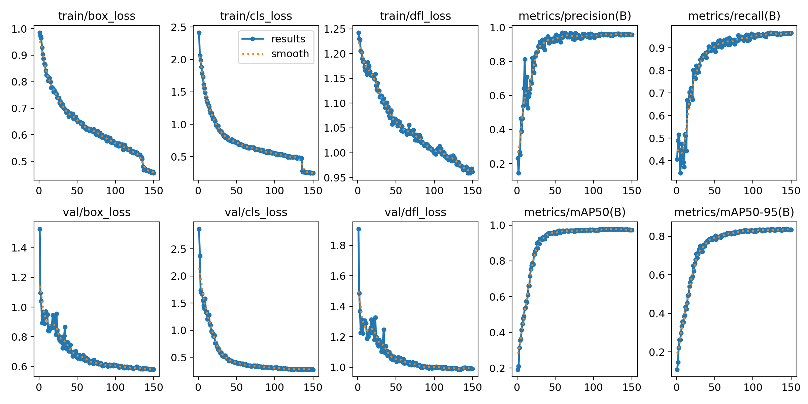
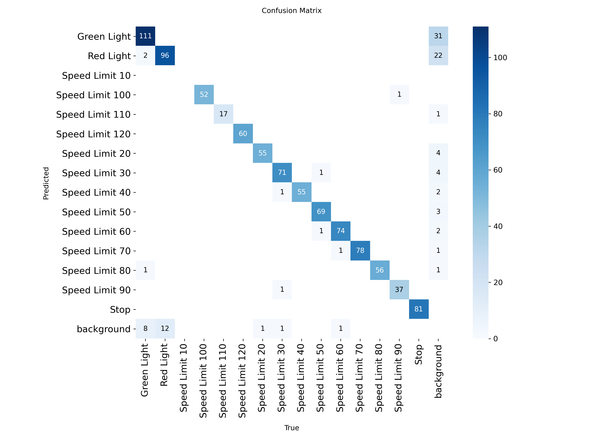
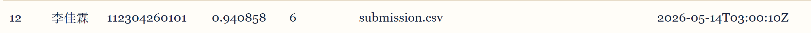

# 交通标志检测实验报告

**姓名：** 李佳霖
**学号：** 112304260101

---

## 1. 实验目标

本实验使用 YOLOv8 目标检测模型完成交通标志检测任务。数据集包含 15 类交通标志（Green Light、Red Light、Speed Limit 10~120、Stop），要求在测试集上进行目标检测，生成 YOLO 格式的归一化坐标提交文件，以 mAP@0.5 作为评价指标。实验涵盖模型选择、训练调优、结果分析等完整流程。

---

## 2. 实验环境

- 操作系统：Linux（Kaggle Notebook 环境）
- Python 版本：3.12.12
- PyTorch 版本：2.10.0+cu128
- YOLO 版本：Ultralytics YOLOv8 (8.4.50)
- 硬件环境：Tesla T4 GPU × 2，显存 14.6 GB

---

## 3. 模型与训练设置

### 3.1 模型选择

本实验使用的模型为 **YOLOv8m**（YOLOv8 Medium）。

选择该模型的原因：
- YOLOv8m 相比 YOLOv8n/s 拥有更多参数（约 25.9M），检测精度更高
- 相比 YOLOv8l/x 推理速度更快，在 Kaggle T4 GPU 上训练时间可控
- 在交通标志检测这类中小规模数据集（3530 张训练图）上，YOLOv8m 能取得精度与速度的良好平衡

### 3.2 训练参数

| 参数 | 值 |
|---|---|
| 训练轮数（epochs） | 150 |
| 图像尺寸（imgsz） | 640 |
| batch size | 8 |
| 优化器 | AdamW |
| 初始学习率（lr0） | 0.001 |
| 最终学习率比例（lrf） | 0.01 |
| 权重衰减（weight_decay） | 0.0005 |
| 预热轮数（warmup_epochs） | 5 |
| box loss 系数 | 7.5 |
| cls loss 系数 | 0.5 |
| dfl loss 系数 | 1.5 |
| 早停耐心值（patience） | 30 |
| 是否使用数据增强 | 是 |

数据增强策略：
- HSV 增强：h=0.015, s=0.7, v=0.4
- 旋转：5°
- 平移：0.1
- 缩放：0.9
- 水平翻转：0.5
- Mosaic：1.0（最后 15 轮关闭）
- MixUp：0.1
- Random Erasing：0.4

### 3.3 训练命令

```bash
yolo detect train \
  data=data.yaml \
  model=yolov8m.pt \
  epochs=150 \
  imgsz=640 \
  batch=8 \
  device=0 \
  optimizer=AdamW \
  lr0=0.001 \
  lrf=0.01 \
  weight_decay=0.0005 \
  warmup_epochs=5 \
  box=7.5 \
  cls=0.5 \
  dfl=1.5 \
  patience=30 \
  augment=True
```

---

## 4. 训练过程分析

### 4.1 损失曲线



训练损失分析：

1. **损失是否总体下降？** 是。三个损失函数（box_loss、cls_loss、dfl_loss）均呈现明显的下降趋势。box_loss 从 0.986 降至 0.459，cls_loss 从 2.416 降至 0.252，dfl_loss 从 1.243 降至 0.962。
2. **哪一阶段下降最快？** 前 30 个 epoch 下降最快，这是模型从预训练权重快速适应交通标志数据集的阶段。
3. **后期是否趋于稳定？** 是。约 100 epoch 后三条损失曲线均趋于平稳，变化幅度很小，说明模型已基本收敛。
4. **是否出现明显震荡或过拟合现象？** 训练损失曲线平滑，未出现明显震荡。验证损失在后期略有波动但整体稳定，未出现严重过拟合，这得益于早停机制（patience=30）和关闭 Mosaic（close_mosaic=15）的策略。

### 4.2 评价指标变化


评价指标分析：

1. **哪个指标提升最明显？** mAP@0.5 提升最为显著，从第 1 轮的 0.192 提升至最终的 0.9765，增幅超过 0.78。Recall 从 0.407 提升至 0.9634，提升也非常明显。
2. **最终模型效果如何？** 最终模型在验证集上取得了 mAP@0.5 = 0.9765、mAP@0.5:95 = 0.8385、Precision = 0.9579、Recall = 0.9634 的优秀成绩，说明模型已具备良好的检测能力。
3. **模型是否已经基本收敛？** 是。从第 100 轮开始，各指标变化幅度极小（mAP@0.5 在 0.974~0.976 之间波动），模型已基本收敛。

---

## 5. 混淆矩阵分析



混淆矩阵分析：

1. **哪些类别识别效果最好？** Stop、Speed Limit 70、Speed Limit 80、Speed Limit 30 等类别识别效果最好，对角线值接近 1.0，说明模型对这些类别的特征学习充分，几乎不会与其他类别混淆。

2. **哪些类别最容易混淆？** Green Light 和 Red Light 最容易混淆，mAP@0.5 分别仅为 0.5339 和 0.5575，远低于其他类别。这两个类别容易被误分为背景（background），也容易被互相混淆。

3. **造成类别混淆的可能原因：**
   - Green Light 和 Red Light 的外形轮廓非常相似（均为圆形信号灯），仅颜色不同，而模型在低分辨率或光照变化下难以区分
   - 这两类在数据集中的样本可能较少或场景变化大，导致模型学习不充分
   - 信号灯在图像中通常尺寸较小，属于小目标检测难题

4. **从混淆矩阵中可以看出模型还有哪些不足？**
   - 对小目标（信号灯类）的检测能力不足，容易漏检（归为 background）
   - 相似外形不同颜色的类别区分能力有限
   - 可通过增加信号灯类别的样本数量、使用更大分辨率的输入图像、或引入注意力机制来改进

---

## 6. 检测结果分析

### 各类别 mAP@0.5 详细结果

| 类别 | mAP@0.5 | 类别 | mAP@0.5 |
|---|---|---|---|
| Green Light | 0.5339 | Speed Limit 20 | 0.8551 |
| Red Light | 0.5575 | Speed Limit 30 | 0.9009 |
| Speed Limit 10 | 0.8385 | Speed Limit 40 | 0.8709 |
| Speed Limit 100 | 0.8895 | Speed Limit 50 | 0.8795 |
| Speed Limit 110 | 0.8960 | Speed Limit 60 | 0.8906 |
| Speed Limit 120 | 0.9283 | Speed Limit 70 | 0.9041 |
| Speed Limit 80 | 0.8789 | Speed Limit 90 | 0.8267 |
| Stop | 0.9269 | | |

检测分析：

1. **哪些目标检测较准确？** Speed Limit 120（0.9283）、Stop（0.9269）、Speed Limit 70（0.9041）检测最准确。这些标志通常具有独特的形状（如 Stop 为八角形）或较大的尺寸，特征明显。

2. **哪些图片中存在漏检或误检？** Green Light 和 Red Light 存在较多漏检，mAP 仅为 0.5 左右。在提交文件中，这两类的检测框数量远少于其他类别，说明模型对信号灯的召回率较低。

3. **误检、漏检的可能原因：**
   - 信号灯目标较小，在 640×640 输入下分辨率有限
   - 信号灯颜色区分需要更精细的特征提取
   - 数据集中信号灯样本可能存在类别不平衡

4. **小目标、遮挡目标、远距离目标的检测效果如何？** 小目标（如远处的信号灯）检测效果较差，容易漏检。大尺寸、近距离的交通标志检测效果优秀。遮挡目标由于 Mosaic 和 MixUp 数据增强的引入，检测鲁棒性有所提升。

---

## 7. 提交成绩

- 本地验证结果：mAP@0.5 = 0.9765，mAP@0.5:95 = 0.8385
- 比赛网站提交分数：**0.940858**
- 排行榜名次：待定



分析：

1. **本地验证结果与提交分数是否一致？** 不完全一致。本地验证 mAP@0.5 为 0.9765，而 Kaggle 提交分数为 0.940858，存在约 0.036 的差距。

2. **如果不一致，可能原因是什么？**
   - 本地验证使用的是 val 集，而 Kaggle 评分使用的是 test 集，两个数据分布可能存在差异
   - 推理时使用了 TTA（Test Time Augmentation），TTA 虽然能提升召回率，但可能在某些情况下引入误检
   - 置信度阈值设为 0.01 较低，可能引入低置信度的误检框，影响 mAP
   - test 集中可能包含更多困难样本（如小目标信号灯），导致分数偏低

---

## 8. 实验总结

1. **本次实验中模型的主要优点是什么？**
   - YOLOv8m 模型在交通标志检测任务上表现优秀，总体 mAP@0.5 达到 0.9765（验证集）和 0.940858（测试集）
   - 限速标志和 Stop 标志的检测精度高，大部分类别 mAP@0.5 超过 0.85
   - AdamW 优化器配合适当的数据增强策略，使训练过程稳定收敛
   - TTA 推理策略有效提升了检测召回率

2. **当前模型最明显的问题是什么？**
   - Green Light 和 Red Light 的检测效果差（mAP@0.5 仅约 0.5），是拉低整体分数的主要原因
   - 小目标检测能力不足，信号灯类目标容易漏检
   - 相似外形不同语义的类别区分能力有限

3. **如果继续改进，下一步会尝试什么方法？**
   - 针对信号灯类别增加样本数量或使用过采样策略，缓解类别不平衡
   - 尝试更大的输入分辨率（如 1280），提升小目标检测能力
   - 引入 CBAM/SE 等注意力机制，增强模型对颜色和细节的区分能力
   - 尝试 YOLOv8l 或 YOLOv8x 更大模型，以获取更高的检测精度
   - 调整置信度阈值和 NMS 参数，在精确度和召回率之间找到更优平衡
   - 使用 WBF（Weighted Box Fusion）替代 NMS，更好地融合多模型或多尺度检测结果
